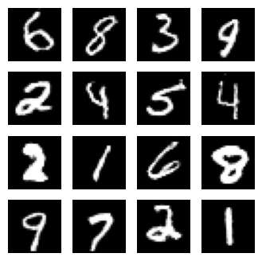

# Conditional GAN on MNIST Digits



---

## Motivation

Training GANs can be notoriously tricky — especially for conditional generation where the label guides the
generator and is verified by the discriminator.

This project explores stabilizing Conditional GAN (CGAN) training on MNIST with:

- Minimal architectural complexity
- Vanilla GAN loss (no spectral norm, no self-attention)
- Clean, interpretable results

The result? Fast, stable training producing clear, class-conditional MNIST digits often within just **2–3 epochs**.

---

## Model Architecture

### Generator

- Label embedded and reshaped into a spatial map
- Noise vector mapped and reshaped into a 7×7 feature map
- Condition and noise representations concatenated along channels
- Up-sampling via Conv2DTranspose layers with batch normalization and LeakyReLU activations

**Flow:**

    Input: z (latent noise), y (label)
        → Embed(y) → Reshape to 7×7×1
        → Dense(z) → Reshape to 7×7×128
        → Concatenate condition + noise
        → Conv2DTranspose → BatchNorm → LeakyReLU (x2)
        → Final Conv2D → tanh activation (output 28×28×1)


---

### Discriminator

- Label embedded and reshaped to match input image dimensions
- Concatenation of image and label embedding
- Downsampling via strided Conv2D layers with batch normalization and LeakyReLU
- GlobalMaxPooling2D replaces Flatten for better stability
- Dense sigmoid output layer for real/fake classification

**Flow:**

    Input: image, y (label)
    → Embed(y) → Reshape to 28×28×1
    → Concatenate with input image
    → Conv2D → BatchNorm → LeakyReLU (x2)
    → GlobalMaxPooling2D → Dropout → Dense(1, sigmoid)


---

## Project Structure

cgan-mnist-digit/
        ├── models.py                   # Core CGAN model definition
        ├── utils.py                    # Training utilities: losses, gradients, plotting
        ├── dataloader_generator.py     # Dataset class and DataLoader setup for DIV2K
        ├── demo_script.py              # Script for training and evaluation
        ├── demo.ipynb                  # Jupyter notebook with explanations, training, and results visualization
        ├── requirements.txt            # Python dependencies for easy setup
        ├── README.md                   # This documentation file

---

## Getting Started

### Requirements

```bash
 Install dependencies with:

    pip install -r requirements.txt
    
```
 ### Running the Demo:
 ```bash
     python demo_script.py
     jupyter notebook demo.ipynb
     
```
---


