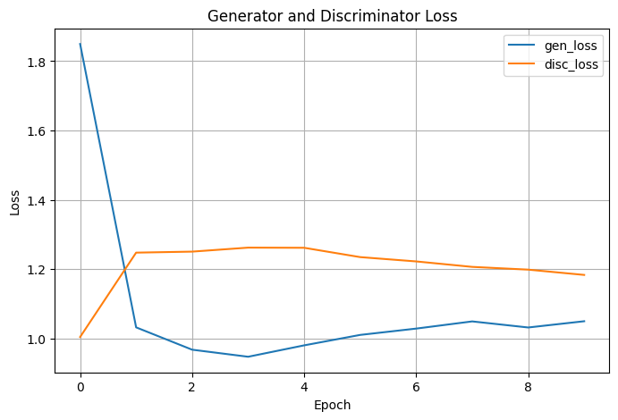
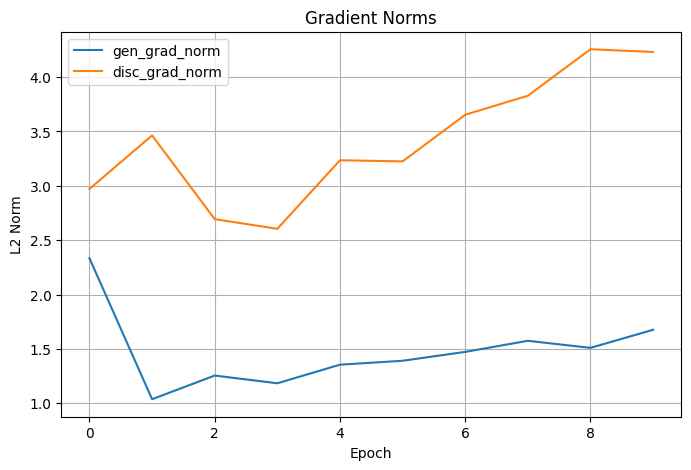
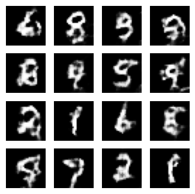
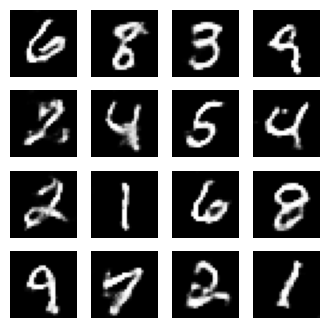
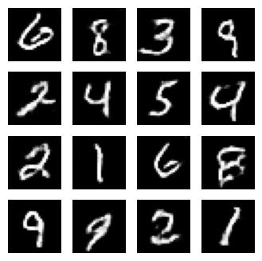
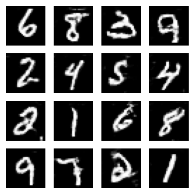
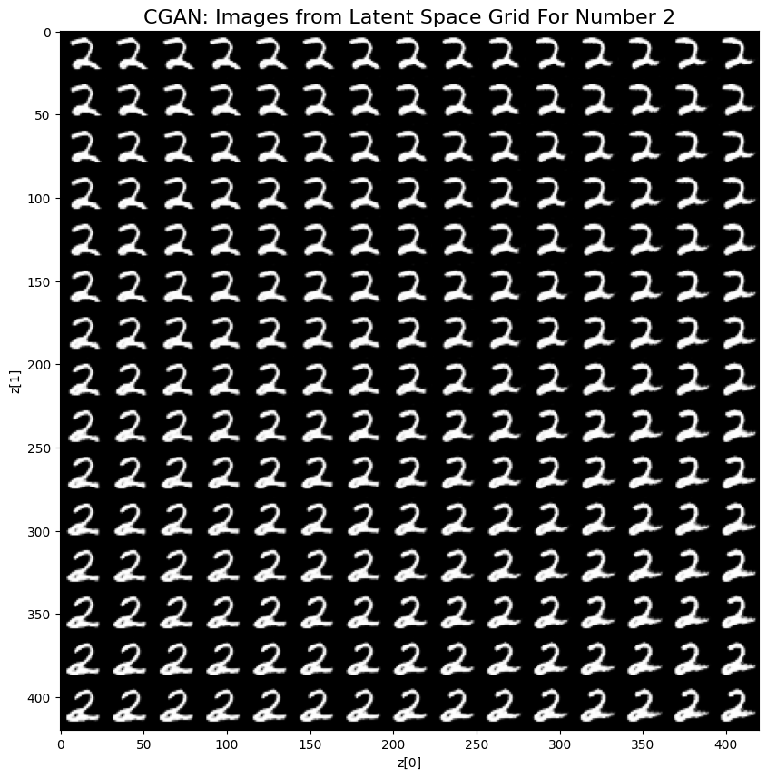
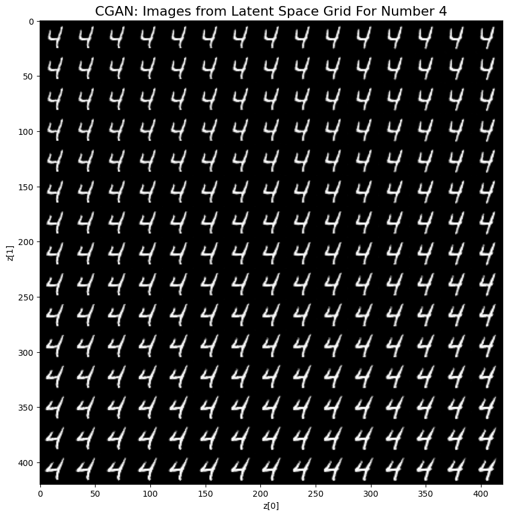

# Conditional GAN for MNIST Digit Generation

This project implements a **Conditional Generative Adversarial Network (CGAN)** trained on the **MNIST dataset**
to generate high-quality, class-conditional digit images.

Unlike traditional GANs that generate images without control, CGANs allow you to **specify the digit class** (e.g., generate a "5" or a "9").
This is achieved by **conditioning both the generator and discriminator on class labels**.

What makes this implementation unique is its **simplicity and stability**:
- Uses **vanilla GAN loss** (no Wasserstein, no hinge loss, no tricks)
- Achieves **sharp and clean generation in just 1–3 epochs**
- Demonstrates **stable training curves**, even with minimal tuning

If you're looking for a clean, minimal, and well-commented CGAN implementation that just works — this is it.

---

## Motivation

Training GANs can be notoriously tricky — especially for conditional generation where the label guides the
generator and is verified by the discriminator.

This project explores stabilizing Conditional GAN (CGAN) training on MNIST with:

- Minimal architectural complexity
- Vanilla GAN loss (no spectral norm, no self-attention)
- Clean, interpretable results

The result? Fast, stable training producing clear, class-conditional MNIST digits often within just **2–3 epochs**.

---

## Model Architecture

### Generator

- Label embedded and reshaped into a spatial map
- Noise vector mapped and reshaped into a 7×7 feature map
- Condition and noise representations concatenated along channels
- Up-sampling via Conv2DTranspose layers with batch normalization and LeakyReLU activations

**Flow:**

    Input: z (latent noise), y (label)
        → Embed(y) → Reshape to 7×7×1
        → Dense(z) → Reshape to 7×7×128
        → Concatenate condition + noise
        → Conv2DTranspose → BatchNorm → LeakyReLU (x2)
        → Final Conv2D → tanh activation (output 28×28×1)


---

### Discriminator

- Label embedded and reshaped to match input image dimensions
- Concatenation of image and label embedding
- Downsampling via strided Conv2D layers with batch normalization and LeakyReLU
- GlobalMaxPooling2D replaces Flatten for better stability
- Dense sigmoid output layer for real/fake classification

**Flow:**

    Input: image, y (label)
    → Embed(y) → Reshape to 28×28×1
    → Concatenate with input image
    → Conv2D → BatchNorm → LeakyReLU (x2)
    → GlobalMaxPooling2D → Dropout → Dense(1, sigmoid)

---
## Live Deployment

This project is deployed as a FastAPI web service on **Render**.  
You can try it live here:

[https://generative-adversarial-networks-2.onrender.com/docs](https://generative-adversarial-networks-2.onrender.com/docs)

The API provides a `/gen_images` endpoint where you can request digit generation by specifying the digit class.

---
### Example Request

```json
POST /gen_images
Content-Type: application/json

{
  "value": 9,
  "grid": false,
  "grid_size": 0
}

---

## Project Structure

```bash
cgan-mnist-digit/
        ├── models.py                   # Core CGAN model definition
        ├── utils.py                    # Training utilities: losses, gradients, plotting
        ├── demo_script.py              # Full training script with data pipeline
        ├── demo.ipynb                  # Jupyter notebook with explanations, training, and results visualization
        ├── requirements.txt            # Python dependencies for easy setup
        ├── README.md                   # This documentation file

```

---

## Getting Started

### Requirements

```bash
 Install dependencies with:

    pip install -r requirements.txt
    
```
 ### Running the Demo:
 ```bash
     python demo_script.py
     jupyter notebook demo.ipynb
     
```
---


## Training Results

- **Stable training** achieved quickly, with no mode collapse or oscillation
- Vanilla loss combined with LeakyReLU and GlobalMaxPooling2D gives robust gradients and convergence
- Clear digit generation after only a few epochs

| Epoch | Generator Loss | Discriminator Loss | Gen Gradient Norm | Disc Gradient Norm |
|-------|----------------|--------------------|-------------------|--------------------|
| 0     | 1.85           | 1.00               | 2.33              | 2.97               |
| 1     | 1.03           | 1.25               | 1.04              | 3.46               |
| 2     | 0.97           | 1.25               | 1.25              | 2.69               |

---




---
### Sample Images During Training at epoch 0,1,2,5 and 9 show high-quality, clear digit synthesis.







---

### Images From The Latent Space Grid For Digits 5,2,4 and 8






---

## How to Run

1. Clone this repository or download files.
2. Run the `demo.ipynb` notebook on [Google Colab](https://colab.research.google.com/) for an easy, interactive experience.
3. Upload `model.py` and `utils.py` to the Colab environment.
4. Follow the notebook instructions to train and visualize results.

---

## Conclusion

This project demonstrates:

- The feasibility of stable and fast CGAN training without complex tricks
- The effectiveness of spatial label embedding and GlobalMaxPooling in discriminator
- How simple architectural design combined with vanilla loss can produce excellent conditional generation

---

