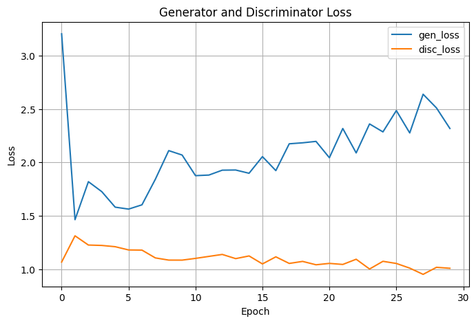
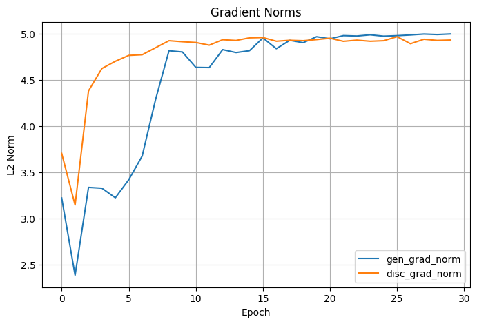
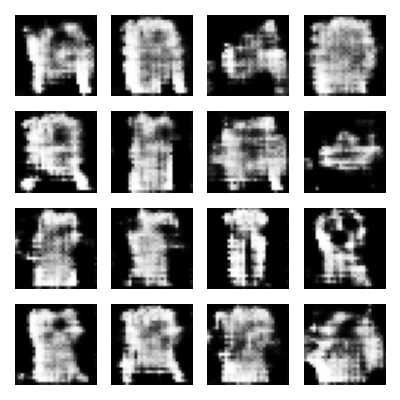
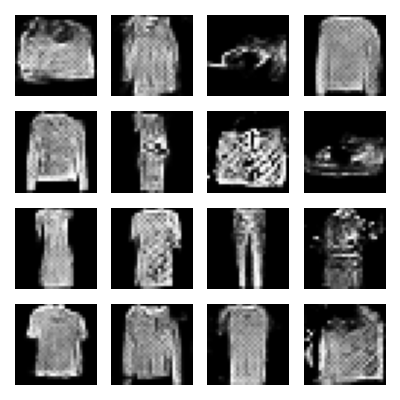
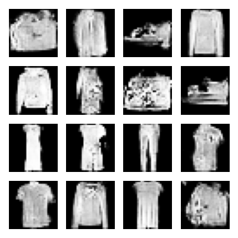
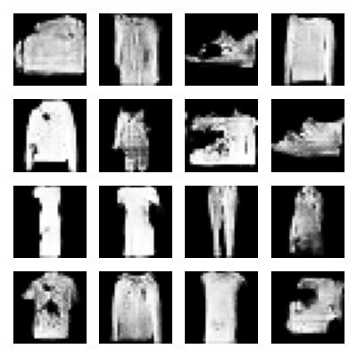
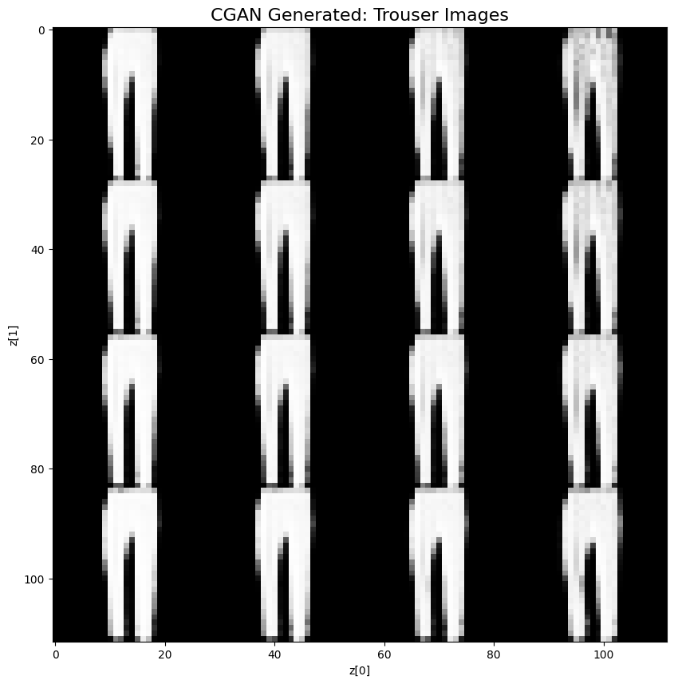
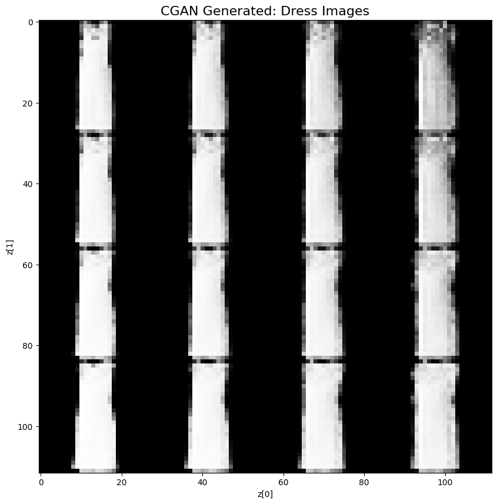
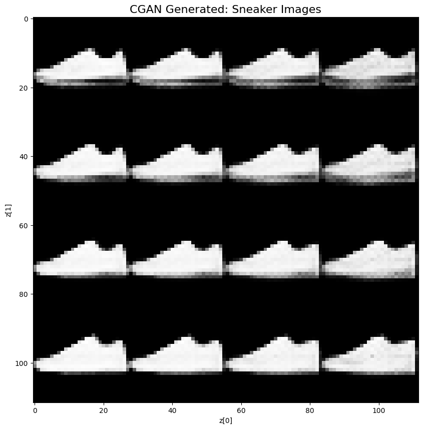
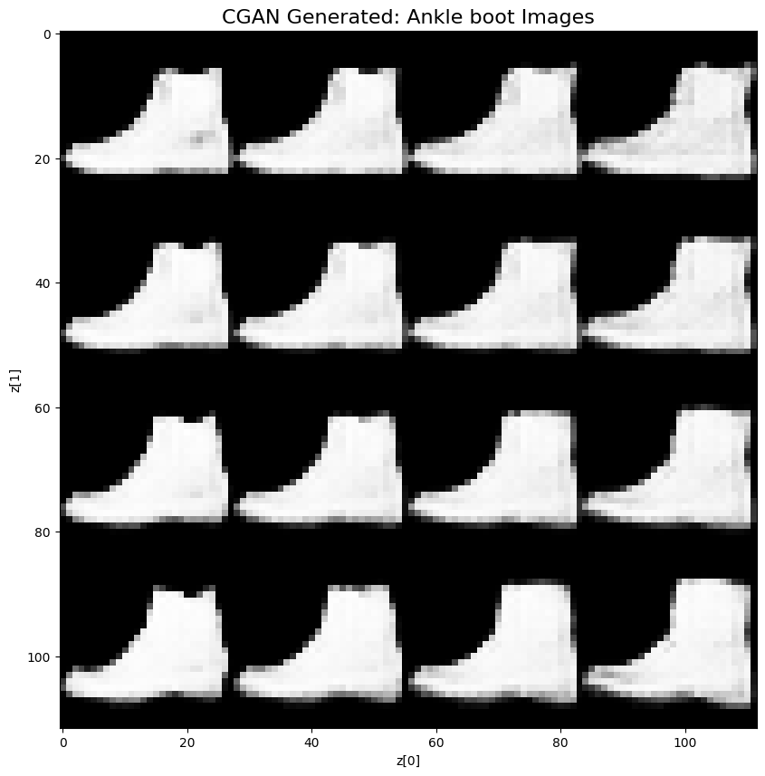

# CGAN on Fashion-MNIST

This repository implements a Conditional Generative Adversarial Network (CGAN) to generate realistic Fashion-MNIST
images conditioned on class labels using TensorFlow 2.x.

Inspired by the foundational CGAN paper by Mirza and Osindero (2014), this project enhances control over image generation
by guiding the model with label information, allowing for category-specific synthetic data generation.

---

##  Motivation

Generative Adversarial Networks (GANs) have become a powerful tool for modeling complex data distributions. However,
vanilla GANs lack explicit control over the types of data they generate. This can be problematic in scenarios where
class-conditional outputs are essential (e.g., data augmentation, fairness testing, domain adaptation).

The Conditional GAN (CGAN) introduces label-conditioning to the GAN framework, enabling generation of images tied to
specific class labels. By applying CGAN to the Fashion-MNIST dataset, this project:

    - Demonstrates label-controlled image generation
    - Offers a modular and reusable CGAN framework
    - Tracks and visualizes gradient norms and losses to monitor GAN dynamics
    - Compares vanilla GAN loss vs. Wasserstein loss with gradient penalty
    
---

## Model Architecture

### Generator

. Inputs: random latent vector z, and label embedding
. Architecture:
    - Label and noise embedded separately, then concatenated
    - Upsampled using transposed convolutions to 28×28
    - tanh activation at output layer
    
### Discriminator

. Inputs: image and label embedding (reshaped to image size)
. Architecture:
    - Concatenate condition with image
    - 2D convolutional layers + LeakyReLU
    - Outputs scalar probability (real or fake)

---

## Project Structure

```bash

cgan-mnist-fashion/
        │
        ├── model.py              # CGAN model class: generator, discriminator, conditioning logic
        ├── utils.py              # Loss functions, training steps, gradient tracking, plotting
        ├── demo_script.py        # Script for training the CGAN end-to-end
        ├── demo.ipynb            # Annotated notebook for training + visualization
        ├── requirements.txt      # All necessary dependencies
        └── README.md             # This documentation file


```

---

## Getting Started

### Requirements

```bash
 Install dependencies with:

    pip install -r requirements.txt
    
```
 ### Running the Demo:
 ```bash
     python demo_script.py
     jupyter notebook demo.ipynb
     
```
---

## Training Results

| Epoch | Gen Loss | Disc Loss | Gen Grad Norm | Disc Grad Norm | Time (min) |
| ----- | -------- | --------- | ------------- | -------------- | ---------- |
| 0     | 3.2024   | 1.0679    | 3.2218        | 3.7053         | 1.7371     |
| 5     | 1.5634   | 1.1815    | 3.4194        | 4.7673         | 8.6285     |
| 10    | 1.8762   | 1.1026    | 4.6373        | 4.9069         | 8.6022     |
| 15    | 2.0541   | 1.0508    | 4.9564        | 4.9609         | 8.6108     |
| 20    | 2.0439   | 1.0557    | 4.9471        | 4.9532         | 8.6022     |
| 25    | 2.4847   | 1.0551    | 4.9811        | 4.9702         | 8.5859     |
| 29    | 2.3173   | 1.0100    | 4.9998        | 4.9337         | 6.8836     |

---




---

###  Images Generated During Training Epoch 1,10,20 and 30










---

###  Images From The Latent Space Conditioned On Class Lables






---

## Conclusion

Conclusion

This project demonstrates the successful implementation of a Conditional Generative Adversarial Network (CGAN) on the
Fashion-MNIST dataset using TensorFlow 2. The model learns to generate class-conditional fashion images by incorporating
both latent noise and label embeddings.

**Key Outcomes**

. Stable Training: Gradient norms for both generator and discriminator remained well-regulated with optional clipping, allowing
  for stable convergence.

. Effective Conditioning: The model produces visually meaningful outputs corresponding to specific labels, validating
  the efficacy of conditional generation.

. Loss Behavior: Generator loss stabilized after initial training epochs, while discriminator loss remained consistent,
  indicating a balanced adversarial setup.

. Latent Traversal Visualization: Grid-based sampling shows smooth variations within class manifolds, reflecting good
  use of latent space.

---
