# CycleGAN: Horse ↔ Zebra Image Translation

This repository implements a **Cycle-Consistent Generative Adversarial Network (CycleGAN)** for translating images between horses and zebras
— **without paired data**. It leverages adversarial learning and cycle-consistency to perform **unpaired image-to-image translation**.

---

## Motivation

Many real-world image translation tasks don't have paired data (e.g., horse image ↔ corresponding zebra image). Traditional supervised
methods can't handle this. CycleGAN solves this by:

- Using unpaired images from two domains.
- Learning a transformation in both directions (e.g., Horse → Zebra and Zebra → Horse).
- Enforcing *cycle consistency*, so that a horse turned into a zebra and then back to a horse should look like the original.

---

##  Model Architecture

CycleGAN consists of two generators and two discriminators:

```bash
      [Horse] --G_A2B--> [Fake Zebra] --G_B2A--> [Reconstructed Horse]
        |                     |                      |
      D_A (real/fake)      D_B (real/fake)       Cycle Loss (A ↔ A)

      [Zebra] --G_B2A--> [Fake Horse] --G_A2B--> [Reconstructed Zebra]
```

### Components:

- **Generators**: Based on ResNet blocks with InstanceNorm.
- **Discriminators**: PatchGAN (classifies real/fake at patch level).
- **Losses**:
  - Adversarial Loss (GAN loss)
  - Cycle Consistency Loss (L1 loss)
  - Identity Loss (optional, improves color preservation)

---

## Project Structure

```bash
   CycleGAN-horse-zebra/
            ├── demo_script.py              # Main training script
            ├── demo.ipynb                  # Interactive Colab notebook
            ├── models.py                   # Generator & Discriminator architectures
            ├── utils.py                    # Loss, training loop, plotting, evaluation
            ├── requirements.txt            # Python dependencies
            ├── loss.txt                    # Training logs per epoch
            ├── samples/                    # Folder with saved generated images
            └── README.md                   # Project documentation (this file)
```

---

## Getting Started

### Requirements

```bash
 Install dependencies with:

    pip install -r requirements.txt
    
```
 ### Running the Demo:
 ```bash
     python demo_script.py
     jupyter notebook demo.ipynb
     
```
---

## Training Results

CycleGAN was trained for **20 epochs** on the Horse ↔ Zebra dataset. Below are selected epochs showing loss and gradient trends:

| Epoch | Gen A→B Loss | Gen B→A Loss | Disc A Loss | Disc B Loss | Gen A→B Grad | Gen B→A Grad |
|-------|--------------|--------------|-------------|-------------|--------------|--------------|
| 0     | 3.9604       | 3.7898       | 0.6840      | 0.6655      | 8.6953       | 8.8176       |
| 5     | 3.0240       | 2.6183       | 0.6408      | 0.5228      | 11.2567      | 7.5522       |
| 10    | 2.8998       | 2.4541       | 0.6297      | 0.4879      | 11.6157      | 8.4276       |
| 15    | 3.0911       | 2.4701       | 0.6167      | 0.4366      | 13.8452      | 9.0250       |
| 19    | 2.9674       | 2.4111       | 0.6150      | 0.4446      | 13.0024      | 9.4606       |

**Observations**:
    - Generator loss decreases and stabilizes around epoch 10–15.
    - Discriminator loss converges below 0.5, indicating balanced training.
    - Gradients increase as generators learn more complex mappings.

---
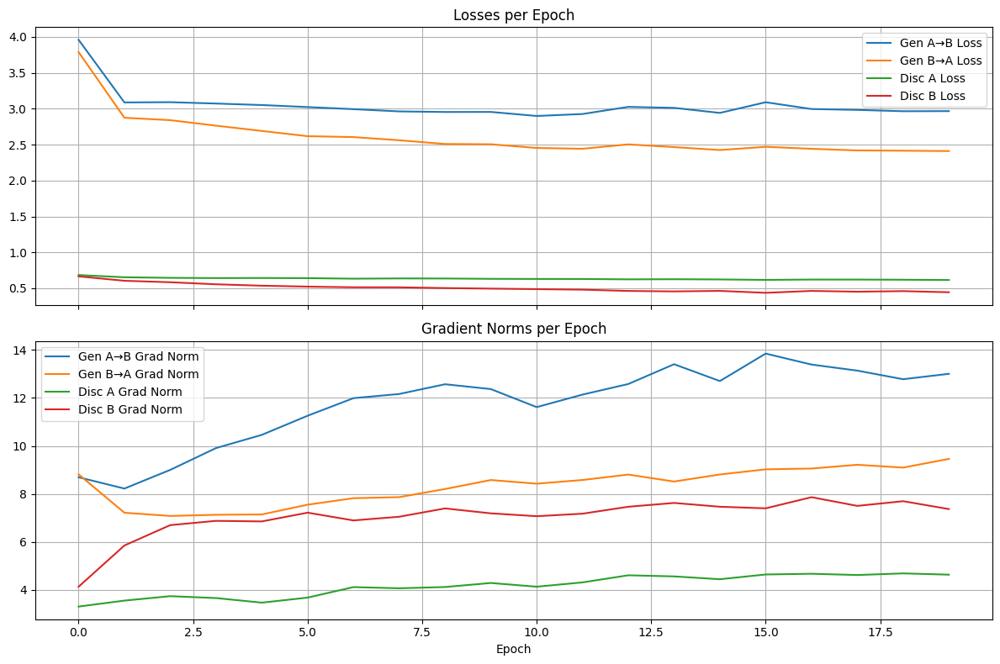
---
## Qualitative Results

### Images generated during training at epoch 1,5,10,15 and 20

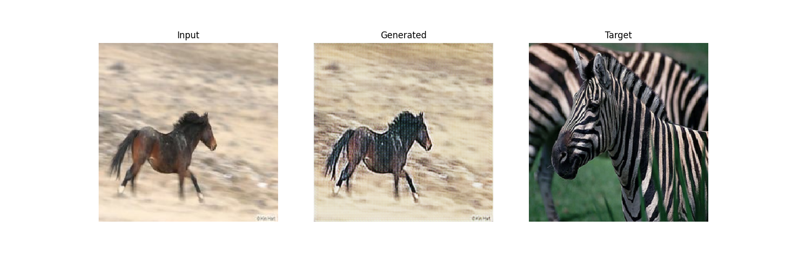
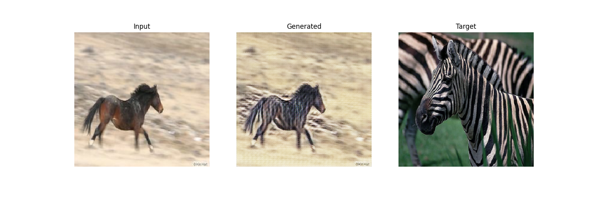
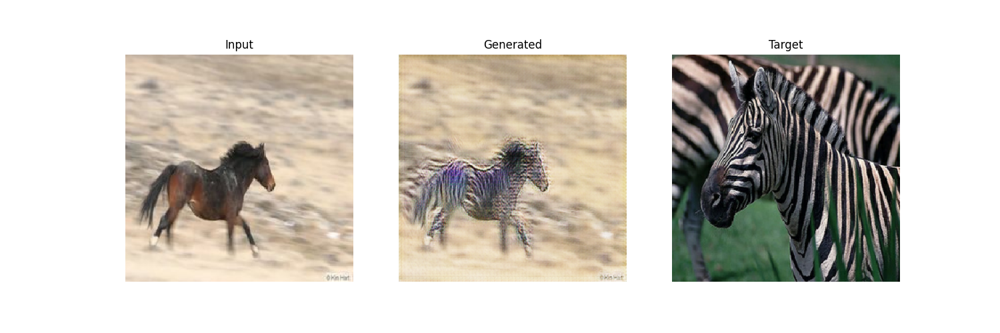
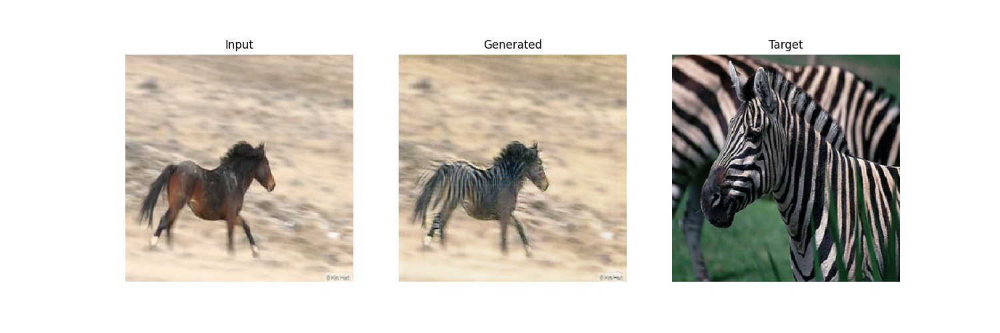
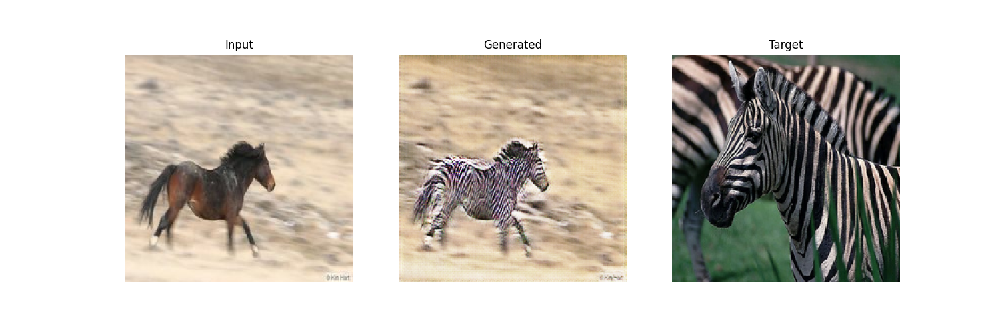

---

### Here are sample image translations after training:

**Horese to Zebra**

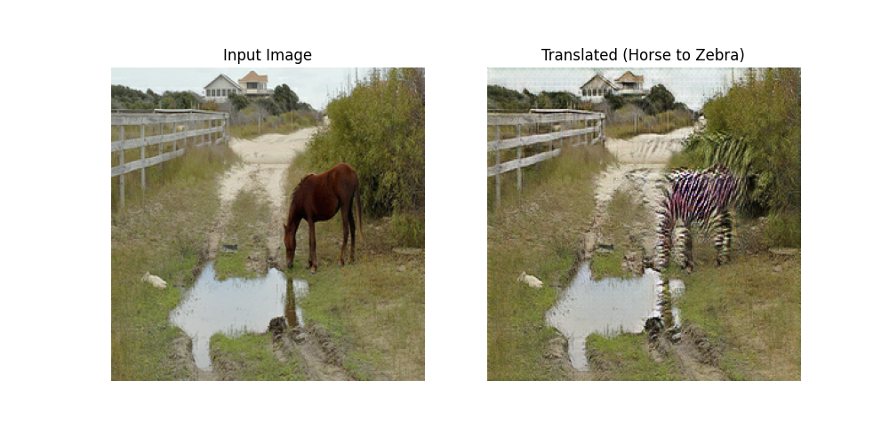
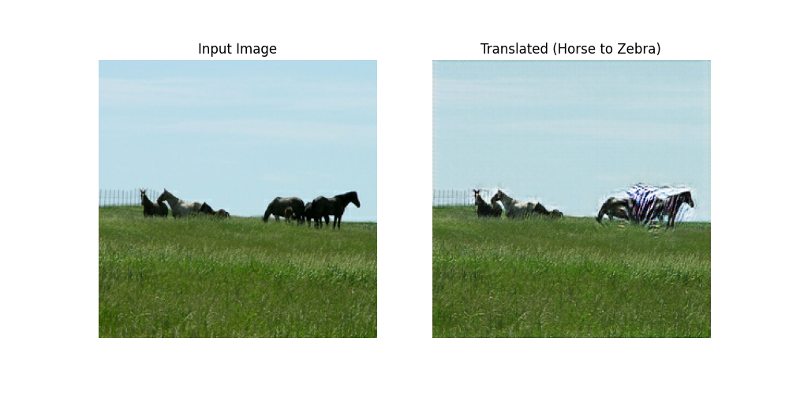
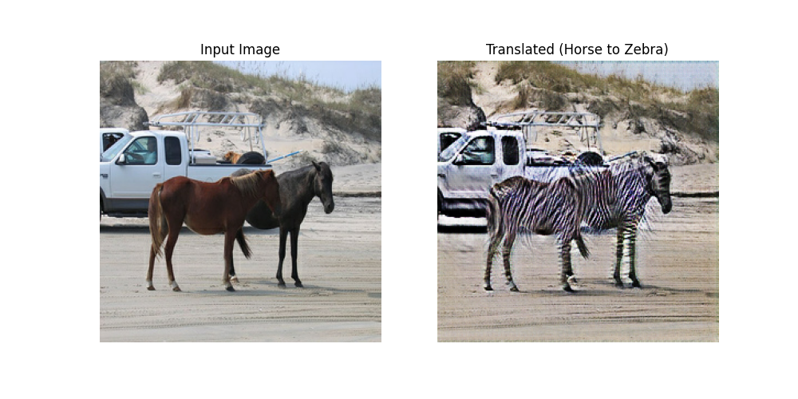
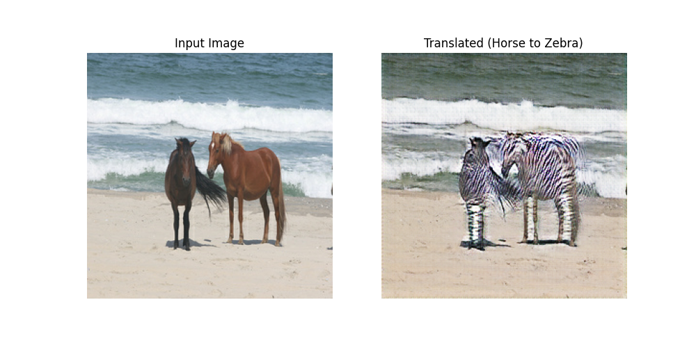
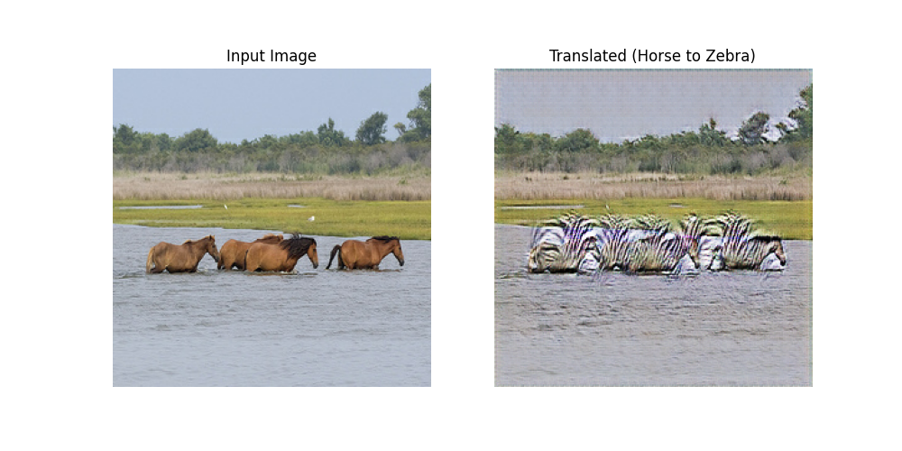

---

**Zebra to Horse**

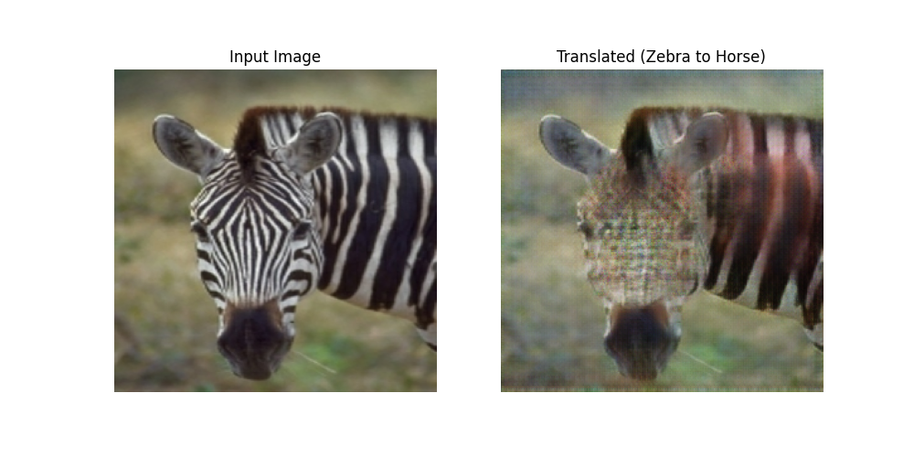
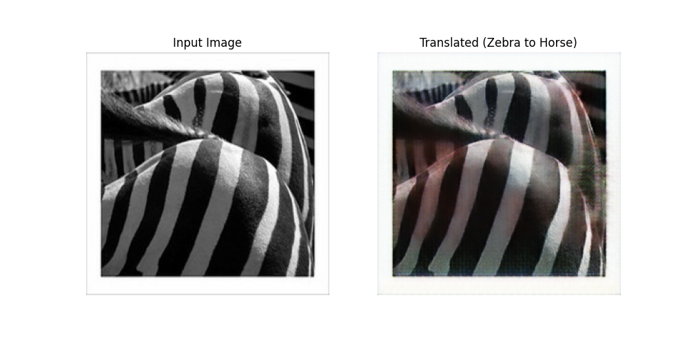
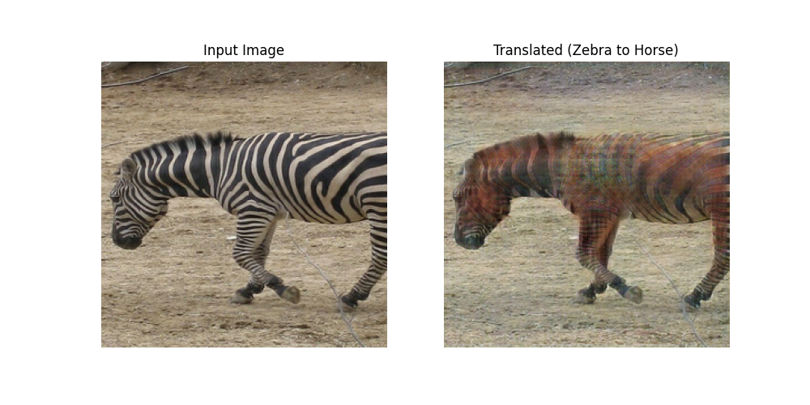
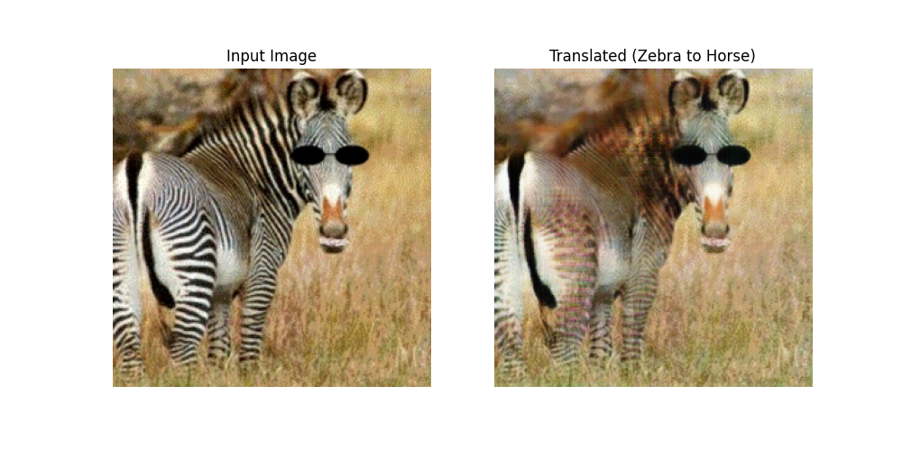
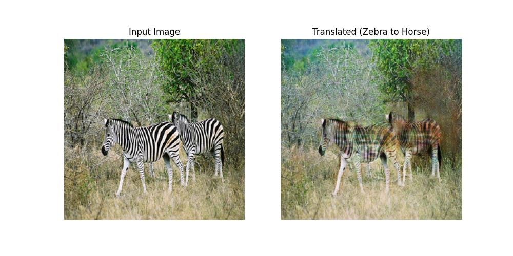

---

## Conclusion

CycleGAN is a powerful framework for unpaired image-to-image translation. This project demonstrates how CycleGAN can:

- Learn domain mappings without aligned image pairs.
- Produce convincing, high-resolution translations.
- Be extended to other tasks like face aging, sketch → photo, or day ↔ night.

The training was stable and results show good translation quality by epoch 15–20.

---
