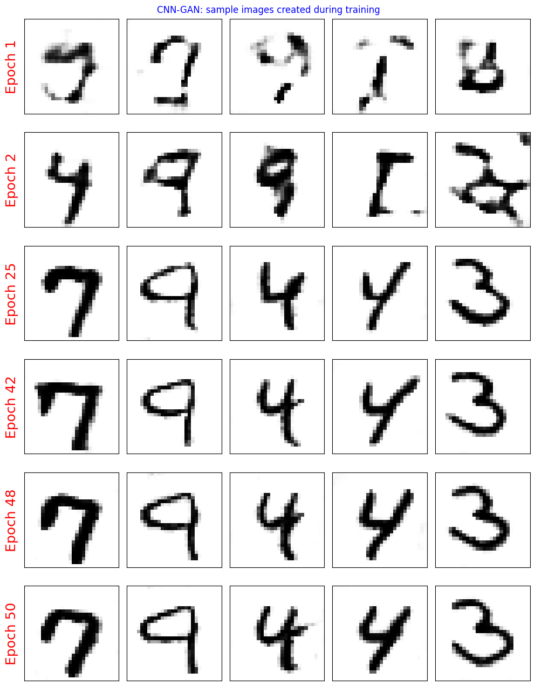

# MLP vs DCGAN on MNIST

A comparative study of image generation using two types of Generative Adversarial Networks (GANs) on the
MNIST handwritten digits dataset:

- **MLP-GAN**: A GAN built using only fully connected layers
- **DCGAN**: A Deep Convolutional GAN using convolutional layers

---

## Motivation

GANs have become a fundamental tool in generative modeling, particularly for images. However, not all
architectures perform equally. This project investigates how two types of GANs—one using basic multilayer
perceptrons (MLPs) and the other using convolutional layers (DCGAN)—compare in terms of:

- Visual quality of generated digits
- Training stability and loss behavior
- Susceptibility to issues like mode collapse

The goal is to demonstrate the importance of architectural choices when designing GANs for image data.

---


## Project Structure

```bash
.
├── models.py                 # Contains MLP-GAN and DCGAN architectures
├── utils.py                  # Training loops, noise sampling, visualization
├── demo_script.py           # Script version of the training and evaluation
├── demo.ipynb               # Jupyter notebook with explanations and outputs
├── requirements.txt         # List of dependencies
├── images/                  # Output training images and plots
│   ├── mlp_loss.png
│   ├── cnn_loss.png
│   ├── mlp_training_images.png
│   ├── cnn_training_images.png
│   ├── mlp_after_training_images.png
│   └── cnn_after_training_images.png
└── README.md

---

## Getting Started

### Requirements

```bash
 Install dependencies with:

    pip install -r requirements.txt
    
```
 ### Running the Demo:
 ```bash
     python demo_script.py
     jupyter notebook demo.ipynb
     
```
---

## Results

### Training Loss Curves

**MLP-GAN Loss per Epoch**  


**DCGAN Loss per Epoch**  


---

### Generated Samples During Training

**MLP-GAN Training Samples by Epoch**  


**DCGAN Training Samples by Epoch**  


---

### Final Output Images (After Training)

**MLP-GAN Final Output (20x20 Grid)**  


**DCGAN Final Output (20x20 Grid)**  


---

## key_observations:

  - Mode Collapse in MLP-GAN:
      description: ->
        The MLP-based GAN tends to suffer from mode collapse when trained for many epochs,
        producing repetitive and less diverse outputs.
        
  - DCGAN Generates Clearer Images:
      description: ->
        DCGAN produces sharper, more coherent images, even early in training. It better captures
        the structure of MNIST digits.
        
  - More Stable Training in DCGAN:
      description: ->
        DCGAN demonstrates smoother loss curves and a more balanced adversarial training process
        compared to MLP-GAN.
        
  - MLP-GAN Struggles with Spatial Patterns:
      description: ->
        Without convolutional layers, the MLP-GAN cannot learn spatial hierarchies effectively,
        resulting in blurred or poorly formed digits.

---

##  Conclusion

  This project highlights the critical role of architecture in GAN-based image generation. While
  the MLP-GAN is simple and easy to implement, it is unstable and often fails to generate diverse,
  high-quality digits. In contrast, DCGAN leverages convolutional layers to achieve better training
  stability and significantly superior image quality. For image-based generative tasks, convolutional
  GANs like DCGAN are strongly recommended as a baseline.
