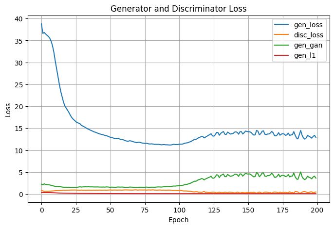
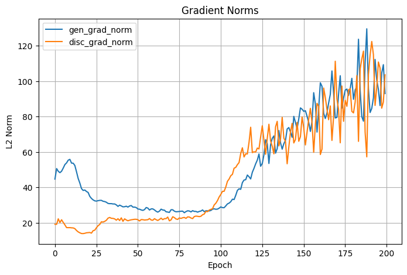
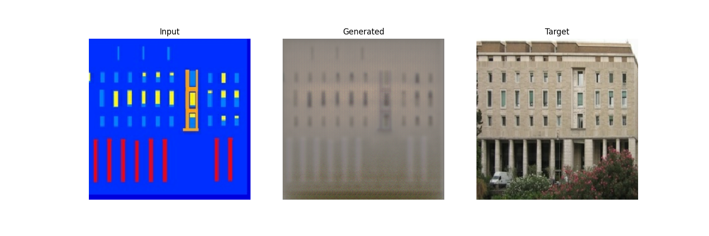
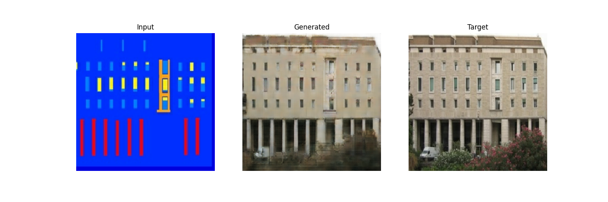
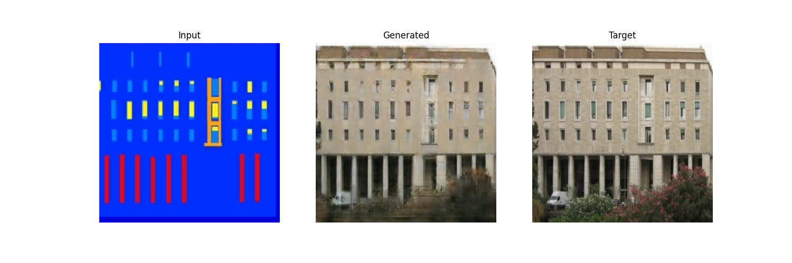
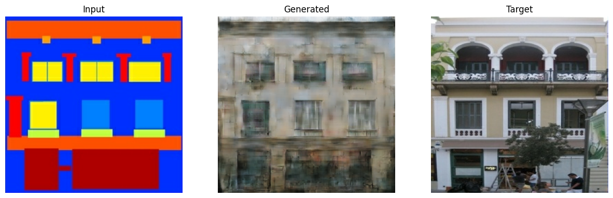
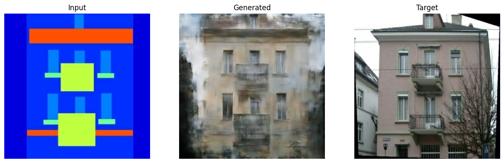
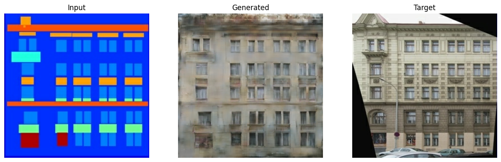
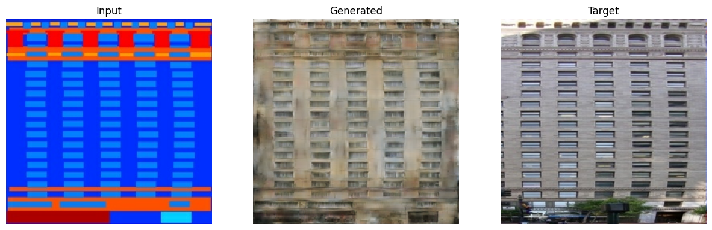

# Pix2Pix on CMP Facade Dataset

This repository implements a **Pix2Pix** model for **image-to-image translation** using the
[CMP Facade Dataset](http://cmp.felk.cvut.cz/~tylecr1/facade/) — translating facade photos to
their semantic labels and vice versa.

The model follows the architecture and loss setup described in the original
[Pix2Pix paper](https://arxiv.org/abs/1611.07004) using a **U-Net generator** and **PatchGAN discriminator**,
built with TensorFlow 2.x.

---

##  Motivation

Semantic segmentation and structural understanding of urban environments are crucial tasks in many domains such as
urban planning, architectural analysis, and autonomous navigation. Traditional supervised learning methods require
extensive labeled data, which is costly and time-consuming to produce.

The **Pix2Pix framework** offers an elegant solution by leveraging **conditional GANs** to learn a mapping from input
images to target outputs using paired training data. In the context of the **CMP Facade Dataset**, this allows us
to automate the process of translating real-world building photos into labeled structural representations and vice
versa — a foundational step for applications in **smart cities**, **AR/VR**, and **digital twin modeling**.

This project aims to:
- Explore the power of GANs for structured image-to-image tasks
- Build a reusable and modular Pix2Pix training pipeline
- Provide insights through gradient monitoring and visual evaluation

---

## Dataset: CMP Facade

- Source: [CMP Facade Dataset](http://cmp.felk.cvut.cz/~tylecr1/facade/)
- Format: Images are paired side-by-side (input | target)
- Tasks:
  - Photo → Label
  - Label → Photo

Data is split into:
- `train/`
- `val/`
- `test/`

---

## Model Architecture

### Generator
- U-Net encoder–decoder
- Skip connections between encoder & decoder layers
- Last layer uses `tanh` activation

### Discriminator
- PatchGAN (classifies 70×70 patches)
- Outputs a feature map of predictions (real vs. fake)

---
## Project Structure

```bash
pix2pix-facade/
        ├── models.py                   # Core CGAN model definition
        ├── utils.py                    # Training utilities: losses, gradients, plotting
        ├── demo_script.py              # Full training script with data pipeline
        ├── demo.ipynb                  # Jupyter notebook with explanations, training, and results visualization
        ├── requirements.txt            # Python dependencies for easy setup
        ├── README.md                   # This documentation file

```

---

## Getting Started

### Requirements

```bash
 Install dependencies with:

    pip install -r requirements.txt
    
```
 ### Running the Demo:
 ```bash
     python demo_script.py
     jupyter notebook demo.ipynb
     
```
---

## Training Results


        | Setting        | Value        |
        |----------------|--------------|
        | Epochs         | 200          |
        | Batch Size     | 1            |
        | Optimizer      | Adam         |
        | Learning Rate  | 2e-4         |
        | Loss           | GAN + L1     |
        | L1 Weight (λ)  | 100          |
        | Clip Norm      | Optional     |
        

---

##  Evaluation Results

After training for **200 epochs**, the model achieved:

| Metric         | Value   |
|----------------|---------|
| **Avg PSNR**   | 12.89   |
| **Avg SSIM**   | 0.1130  |

These results suggest basic structure matching but low perceptual fidelity — consistent with early Pix2Pix
performance on this dataset.





---

###  Images Generated During Training Phase At Epoch 1, 50,100,150,and 200








---

###  Images Generated After Training Using Test Set






---

## Conclusion

In this project, we implemented a modular and fully functional **Pix2Pix model** using TensorFlow 2, trained on the
**CMP Facade Dataset**. The model successfully learns the translation between photographs and their semantic segmentation
labels using paired data.

Key takeaways:
- The model architecture (U-Net + PatchGAN) is effective for structured image translation tasks.
- Training from scratch with basic augmentation yields reasonable PSNR and SSIM scores, even without extensive tuning.
- Gradient monitoring and visual output inspection are valuable tools for debugging GAN training dynamics.

Despite moderate performance (Avg PSNR: 12.89, SSIM: 0.1130), the project showcases a strong foundation for extending to other datasets (e.g., maps, edges2shoes), improving realism with perceptual losses, or deploying for real-world scene parsing applications.

This work serves both as an educational exercise and a launchpad for more advanced research in **conditional generative models**.

---
