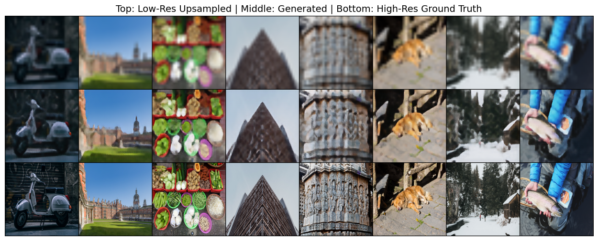

# Super-Resolution GAN on DIV2K Dataset

Single-image super-resolution (SISR) aims to reconstruct high-resolution (HR) images from low-resolution (LR) inputs. This is crucial
for applications in medical imaging, satellite imagery, surveillance, and general photo enhancement. Traditional interpolation methods
often produce blurry results, whereas deep learning models, especially GANs, can generate sharper and more realistic textures.

This project implements a Wasserstein GAN with Gradient Penalty (WGAN-GP) specifically designed for super-resolution on the DIV2K
dataset, focusing on training stability and high-quality image generation.

---

## Model Structure

- **Generator**: Deep convolutional neural network with residual blocks, skip connections, dropout, and Leaky ReLU activations. Takes LR images (32×32) and upsamples them to HR images (256×256) by learning complex feature mappings.
- **Discriminator**: Convolutional network distinguishing real HR images from generated ones, guiding the generator through adversarial feedback.
- **GAN Type**: WGAN with Gradient Penalty to enforce Lipschitz continuity for stable training.
- Additional features include reconstruction loss (L1), noise injection to real images, and flexible critic update frequency.

---

## Training Setup

- **Dataset**: DIV2K high-resolution images
- **Input Resolution**: 32×32 (LR)
- **Output Resolution**: 256×256 (HR)
- **Optimizer**: Adam with learning rate 1e-3
- **Batch Size**: 20
- **Epochs**: 100
- **Gradient Penalty Lambda**: 10
- **Gradient Clipping**:  
  - Discriminator max norm: 20.0  
  - Generator max norm: 20.0  
- **Additional Losses**: Reconstruction loss applied with weight 200.0  
- **Critic Updates per Generator Update**: 2  
- **Noise Injection**: Applied to real images during discriminator training

---

## Project Structure

super_resolution_wgan/
        ├── models.py                   # Contains Generator and Discriminator architectures
        ├── utils.py                    # Data loading, training loops, gradient penalty, helper functions
        ├── dataloader_generator.py     # Dataset class and DataLoader setup for DIV2K
        ├── demo_script.py              # Script for training and evaluation
        ├── demo.ipynb                  # Jupyter notebook with explanations, training, and results visualization
        ├── requirements.txt            # Python dependencies for easy setup
        ├── README.md                   # This documentation file

---

## Getting Started

### Requirements

```bash
 Install dependencies with:

    pip install -r requirements.txt
    
```
 ### Running the Demo:
 ```bash
     python demo_script.py
     jupyter notebook demo.ipynb
     
```
---

## Training Results

| Epoch | Train Disc Loss | Train Gen Loss | Valid Disc Loss | Valid Gen Loss | Grad Norm Disc | Grad Norm Gen | Time (min) |
|-------|-----------------|----------------|-----------------|---------------|----------------|---------------|------------|
| 1     | 1557.9003       | 40.6990        | 0.0033          | 32.3286       | 20.0           | 20.0          | 0.92       |
| 21    | 0.2862          | 27.3829        | 0.0010          | 28.0494       | 9.4481         | 20.0          | 18.68      |
| 41    | 0.2140          | 26.7445        | 0.0013          | 27.8152       | 4.4913         | 20.0          | 18.65      |
| 61    | 0.1454          | 26.3000        | 0.0017          | 27.7711       | 6.7462         | 19.3454       | 18.56      |
| 81    | 0.1154          | 26.0618        | 0.0009          | 28.1169       | 7.6253         | 13.0198       | 18.70      |
| 100   | 0.0907          | 25.1225        | 0.0004          | 28.1596       | 7.0308         | 11.4490       | 17.89      |

---

## Image Quality Metrics (Validation Set)

| PSNR   | SSIM   |
|--------|---------|
| 18.8730| 0.3616  |
| 19.5545| 0.4020  |
| 19.6564| 0.4051  |
| 19.5560| 0.4042  |
| 19.5024| 0.3991  |

---

### Images Reconstruction During Training at Various Epochs

Below are sample reconstructions from the generator as training progresses.The model learns to reconstruct finer details and textures
with each epoch thanks to adversarial training and skip connections.

Each triplet consists of:

    . Top: Low-resolution (upsampled) input
    . Middle: Super-resolved (generated) image
    . Bottom: Ground truth high-resolution image


Note: These results illustrate how the model becomes increasingly capable of reconstructing sharp, detailed images as training
continues. The skip connections in the generator architecture play a key role in preserving structural integrity and improving
perceptual quality.

---

### Images Reconstruction After Training




---
## Conclusion

This project demonstrates the effectiveness of Wasserstein GANs with Gradient Penalty (WGAN-GP) for image super-resolution on the DIV2K
dataset. By leveraging a carefully designed generator and discriminator, the model is able to produce high-quality upscaled images from
low-resolution inputs.

A key insight from the experiments is the critical role of skip connections in the generator architecture. Incorporating skip connections
allows the model to preserve fine-grained details from the low-resolution input, significantly improving the sharpness and fidelity of
the generated high-resolution images. This architectural choice helps overcome common issues like blurriness and loss of texture, which
are prevalent in naive upsampling methods.

Training with gradient penalty stabilizes the adversarial process, enabling the generator and discriminator to converge more reliably,
as reflected in steady improvements in PSNR and SSIM metrics across epochs.

Overall, this work highlights how combining advanced GAN training techniques with architectural enhancements such as skip connections
leads to more realistic and visually pleasing super-resolution results, paving the way for future improvements in image enhancement tasks.

---
